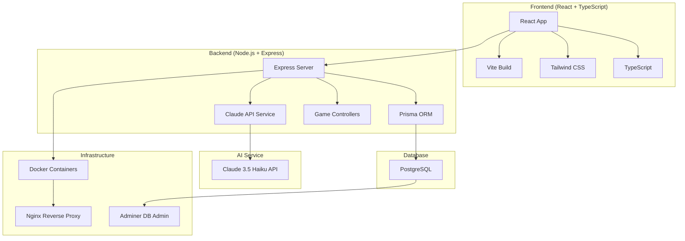
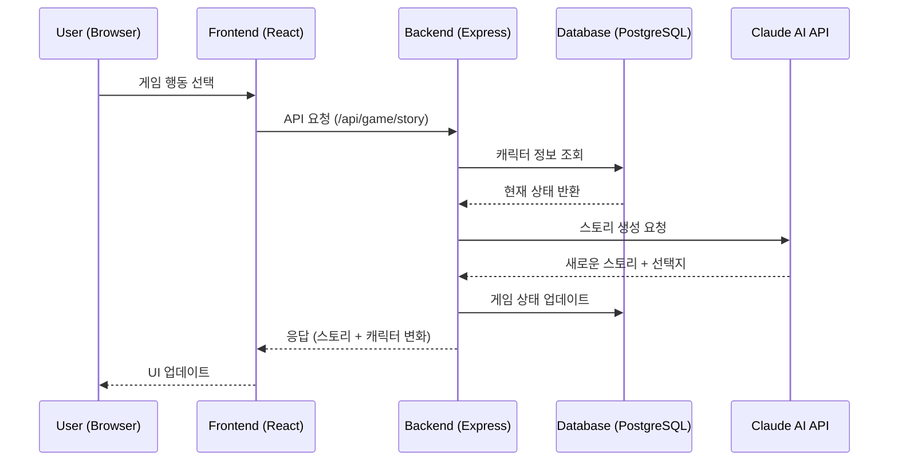
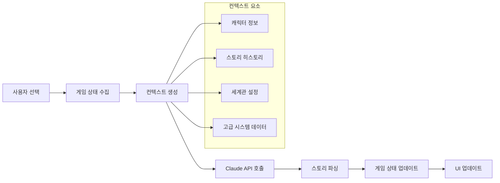
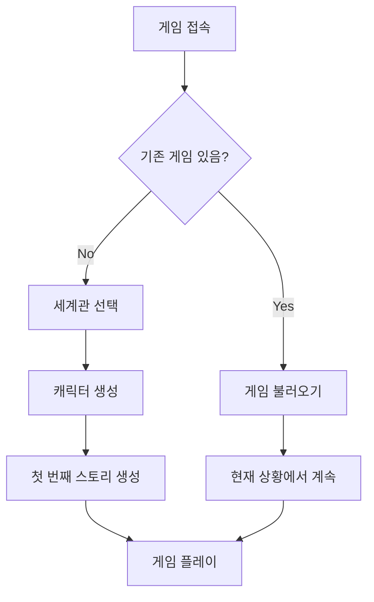
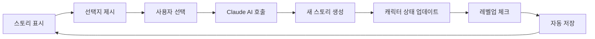
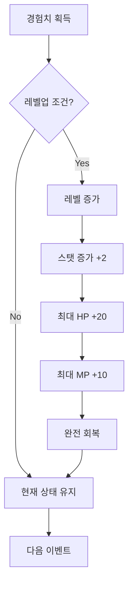

# LLMLIKE 프로젝트 전체 개요 📋

**Claude AI 기반 텍스트 로그라이크 웹 RPG 게임**

---

## 📊 프로젝트 상태 요약

### ✅ 현재 상태
- **배포 상태**: 완전 동작하는 프로덕션 레디 상태
- **인프라**: Docker 컨테이너화 완료 (프론트엔드, 백엔드, 데이터베이스)
- **AI 통합**: Claude 3.5 Haiku API 완전 통합
- **게임 시스템**: 완전한 RPG 시스템 구현 완료

### 🔧 현재 개발 중
- **세계관 시스템**: 다중 세계관 지원 시스템 (🚧 부분 완료)
- **사이버펑크 2187**: 새로운 세계관 구현 중 (🚧 90% 완료)
- **고급 시스템**: 메모리, NPC 관계, 세력 평판 시스템 개발 중

---

## 🏗️ 아키텍처 전체 구조

### 💻 기술 스택



### 🔄 데이터 플로우



---

## 📁 프로젝트 디렉토리 구조

```
LLMLIKE/
├── 📂 src/ (프론트엔드)
│   ├── 📂 components/             # React 컴포넌트
│   │   ├── 🎮 GameScreen.tsx      # 메인 게임 화면
│   │   ├── 👤 CharacterCreation.tsx # 캐릭터 생성
│   │   ├── 🌍 WorldSelector.tsx   # 세계관 선택
│   │   ├── 📊 CharacterStats.tsx  # 캐릭터 상태 표시
│   │   ├── 📖 StoryView.tsx       # 스토리 표시
│   │   ├── 🎯 GameControls.tsx    # 게임 조작
│   │   └── 🔧 AdvancedSystemsDashboard.tsx # 고급 시스템
│   ├── 📂 data/                   # 게임 데이터
│   │   ├── 📂 worldSettings/      # 세계관 설정
│   │   │   ├── 🏰 dimensionalRift.ts   # 차원의 균열 (기본)
│   │   │   ├── 🤖 cyberpunk2187.ts     # 사이버펑크 2187
│   │   │   └── 📋 types.ts              # 세계관 타입 정의
│   │   ├── 🎒 itemIcons.ts        # 아이템 아이콘
│   │   └── 👥 avatars.ts          # 캐릭터 아바타
│   ├── 📂 services/               # API 서비스
│   │   └── 🌐 apiService.ts       # 백엔드 통신
│   ├── 📂 types/                  # TypeScript 타입
│   │   └── 🎲 game.ts            # 게임 핵심 타입
│   └── 📂 utils/                  # 유틸리티 함수
│
├── 📂 server/ (백엔드)
│   ├── 📂 src/
│   │   ├── 📂 controllers/        # API 컨트롤러
│   │   │   ├── 🎮 gameController.ts      # 게임 로직
│   │   │   ├── 👑 adminController.ts     # 관리자 기능
│   │   │   └── 🔧 advancedSystemsController.ts # 고급 시스템
│   │   ├── 📂 services/           # 비즈니스 로직
│   │   │   └── 🤖 claudeService.ts       # Claude AI 통합
│   │   ├── 📂 routes/             # API 라우트
│   │   ├── 📂 types/              # 타입 정의
│   │   └── 📂 data/               # 서버 데이터
│   └── 📂 prisma/                 # 데이터베이스 스키마
│       └── 📄 schema.prisma       # DB 스키마 정의
│
├── 📂 deploy/                     # 배포 설정
├── 🐳 docker-compose.yml         # Docker 설정
├── 🌐 nginx.conf                 # Nginx 설정
└── 📚 문서들/
    ├── 📖 README.md
    ├── 🌍 WORLD_SYSTEM_GUIDE.md
    ├── 🤖 CYBERPUNK_2187_TEMPLATE.md
    └── 📋 LLMLIKE_PROJECT_OVERVIEW.md (이 파일)
```

---

## 🎮 게임 시스템 아키텍처

### 🔧 핵심 게임 엔진

#### 1. 캐릭터 시스템
```typescript
interface Character {
  id: string;
  name: string;
  job: Job;                    // 전사, 마법사, 도적, 성직자 (또는 세계관별 직업)
  level: number;
  health/mana: number;         // 현재/최대 HP/MP
  stats: {                     // 세계관별 능력치
    strength: number;
    intelligence: number;
    dexterity: number;
    constitution: number;
  };
  inventory: Item[];           // 아이템 인벤토리
  skills: Skill[];            // 보유 스킬
  gold: number;               // 보유 골드
  experience: number;         // 경험치
}
```

#### 2. 세계관 시스템 (🚧 개발 중)
```typescript
interface WorldSetting {
  id: string;
  name: string;
  description: string;
  classes: WorldClass[];       // 세계관별 직업
  statNames: Record<string, string>; // 세계관별 능력치명
  regions: Region[];           // 지역 정보
  storyArcs: StoryArc[];      // 스토리 아크
  gameSystems: GameSystem[];   // 특수 시스템
  promptTemplate: {            // AI 프롬프트 템플릿
    systemPrompt: string;
    characterPrompts: Record<string, string>;
    regionPrompts: Record<string, string>;
  };
}
```

#### 3. 스토리 생성 엔진
```typescript
interface StoryGenerationRequest {
  character: Character;
  currentStage: number;
  storyHistory: StoryEvent[];
  userChoice?: string;
  advancedSystems?: {          // 🚧 고급 시스템
    characterMemories: Memory[];
    npcRelationships: NPCRelation[];
    factionReputations: Reputation[];
    activeSideQuests: Quest[];
  };
}
```

### 🧠 AI 스토리 생성 파이프라인



---

## 🚀 현재 구현된 기능들

### ✅ 완전 구현됨

#### 🎮 핵심 게임 시스템
- **캐릭터 생성**: 4개 직업 (전사, 마법사, 도적, 성직자)
- **실시간 스토리 생성**: Claude AI가 매턴 새로운 스토리 생성
- **RPG 메커니즘**: 레벨업, 경험치, 스탯 증가
- **인벤토리 시스템**: 아이템 수집, 관리
- **스킬 시스템**: 직업별 고유 스킬, 새로운 스킬 습득
- **자동 저장**: 게임 진행 상황 자동 저장/복구

#### 🖥️ 사용자 인터페이스
- **현대적 UI**: Tailwind CSS 기반 반응형 디자인
- **실시간 상태 표시**: 체력, 마나, 경험치 바
- **아이템 아이콘**: 직관적인 아이템 시각화
- **캐릭터 아바타**: 직업별 고유 아바타

#### 🛠️ 기술 인프라
- **도커 컨테이너화**: 원클릭 배포 가능
- **Nginx 리버스 프록시**: 성능 최적화
- **PostgreSQL**: 안정적인 데이터 저장
- **Prisma ORM**: 타입 안전한 데이터베이스 액세스

### 🚧 부분 구현됨

#### 🌍 세계관 시스템 (90% 완료)
**구현 완료:**
- 세계관 선택 UI 컴포넌트
- 4개 세계관 데이터 구조
  - 🌟 차원의 균열 (기본 판타지)
  - 🤖 사이버펑크 2187 (99% 완료)
  - 🌑 다크 파이낸스 (임시 구현)
  - 🏰 클래식 판타지 (기본 구현)
- 세계관별 프롬프트 시스템
- WorldManager 클래스

**🔧 진행 중:**
- 세계관별 직업 시스템 완전 통합
- 능력치 시스템 세계관별 분리
- 사이버펑크 세계관 전용 UI 컴포넌트

#### 🔧 고급 시스템 (30% 완료)
**구현 완료:**
- 기본 데이터 구조 설계
- 백엔드 컨트롤러 기본 틀
- 프론트엔드 대시보드 UI

**🔧 개발 필요:**
- 메모리 시스템 완전 구현
- NPC 관계 추적 시스템
- 세력 평판 시스템
- 사이드 퀘스트 관리

---

## 🎯 현재 개발 중인 사항들

### 1. 🤖 사이버펑크 2187 세계관 (우선순위: 높음)

**세계관 개요:**
- 2151년 뉴럴 각성 사건으로 AI와 인간 분열
- 3개 주요 세력: 신테시스트, 퓨어리스트, 밸런서
- 6개 독창적 직업과 새로운 능력치 시스템

**현재 상태:**
- ✅ 세계관 설정 문서 완료 (17KB, 404줄)
- ✅ 직업 시스템 데이터 구조 완료
- ✅ 능력치 시스템 설계 완료
- 🚧 캐릭터 생성 시스템 통합 중
- 🚧 UI 컴포넌트 세계관별 분기 처리 중

**다음 작업:**
1. 캐릭터 생성 시 세계관별 직업 표시
2. 사이버펑크 전용 능력치 UI 개발
3. 세계관별 아이템/스킬 시스템 완성

### 2. 🧠 고급 시스템 (우선순위: 중간)

**메모리 시스템:**
- 캐릭터가 경험한 이벤트들을 기억
- 중요도별 메모리 분류 (critical, major, moderate, minor)
- AI 스토리 생성 시 과거 경험 반영

**NPC 관계 시스템:**
- NPC별 감정 상태 추적 (호감, 적대감, 신뢰, 두려움 등)
- 관계 변화에 따른 스토리 분기
- 연속성 있는 캐릭터 상호작용

**세력 평판 시스템:**
- 각 세력에 대한 평판도 관리
- 평판에 따른 스토리 변화
- 세력 간 관계 영향

### 3. 🌍 추가 세계관 (우선순위: 낮음)

**계획된 세계관들:**
- 🚂 스팀펑크 제국: 증기 기계와 마법이 공존하는 빅토리아 시대
- 🚀 우주 오딧세이: 우주 탐험과 외계 문명과의 조우
- 🧪 포스트 아포칼립스: 핵전쟁 이후 황폐한 세계

---

## 🔄 게임 워크플로우

### 1. 게임 시작 플로우


### 2. 게임 플레이 루프


### 3. 캐릭터 성장 시스템


---

## 🔧 기술적 구현 세부사항

### 🗄️ 데이터베이스 스키마

#### 핵심 테이블들
```sql
-- 사용자
Table users {
  id: string (PK)
  createdAt: datetime
  updatedAt: datetime
}

-- 캐릭터
Table characters {
  id: string (PK)
  name: string
  job: string
  level: int
  health: int
  maxHealth: int
  mana: int
  maxMana: int
  strength: int
  intelligence: int
  dexterity: int
  constitution: int
  gold: int
  experience: int
  userId: string (FK)
}

-- 게임 상태
Table gameStates {
  id: string (PK)
  currentStage: int
  gameStatus: string
  waitingForApi: boolean
  userId: string (FK)
  characterId: string (FK)
}

-- 스토리 이벤트
Table storyEvents {
  id: string (PK)
  stageNumber: int
  content: text
  choices: json
  type: string
  result: text
  selectedChoice: int
  gameStateId: string (FK)
}

-- 아이템
Table items {
  id: string (PK)
  name: string
  description: text
  type: string
  value: int
  effects: json
  characterId: string (FK)
}

-- 스킬
Table skills {
  id: string (PK)
  name: string
  description: text
  manaCost: int
  damage: int
  healing: int
  effects: json
  characterId: string (FK)
}
```

### 🤖 Claude AI 통합

#### API 호출 구조
```typescript
// 프롬프트 생성
const systemPrompt = generateSystemPrompt({
  character: characterData,
  storyHistory: previousEvents,
  worldSetting: currentWorld,
  advancedSystems: contextData
});

// Claude API 호출
const response = await anthropic.messages.create({
  model: 'claude-3-5-haiku-20241022',
  max_tokens: 1000,
  temperature: 0.8,
  system: systemPrompt,
  messages: [{ role: 'user', content: userAction }]
});

// 응답 파싱 및 검증
const storyData = parseAndValidateResponse(response);
```

#### 프롬프트 엔지니어링
- **시스템 프롬프트**: 세계관, 캐릭터 정보, 게임 규칙
- **컨텍스트 주입**: 과거 이벤트, 관계, 평판 정보
- **응답 형식 강제**: JSON 형태로 구조화된 응답
- **상태 변화 계산**: 정확한 수치 변화 로직

---

## 📋 추후 구현 계획

### 🎯 단기 목표 (1-2주)

#### 1. 세계관 시스템 완성
- [ ] 사이버펑크 2187 세계관 완전 통합
- [ ] 세계관별 직업 선택 UI 완성
- [ ] 능력치 시스템 세계관별 분리
- [ ] 게임 내 세계관 전환 시스템

#### 2. 버그 수정 및 안정화
- [ ] 캐릭터 생성 시 세계관 정보 저장 확인
- [ ] 세계관별 시작 아이템/스킬 정상 동작 확인
- [ ] UI 컴포넌트 세계관별 적응

### 🎯 중기 목표 (1-2개월)

#### 1. 고급 시스템 완성
- [ ] 메모리 시스템 완전 구현
- [ ] NPC 관계 추적 시스템
- [ ] 세력 평판 시스템
- [ ] 사이드 퀘스트 관리 시스템

#### 2. 게임플레이 확장
- [ ] 멀티플레이어 기능 (선택적)
- [ ] 더 복잡한 전투 시스템
- [ ] 경제 시스템 (상점, 거래)
- [ ] 길드/파티 시스템

#### 3. 추가 세계관
- [ ] 스팀펑크 제국 세계관
- [ ] 우주 오딧세이 세계관
- [ ] 포스트 아포칼립스 세계관

### 🎯 장기 목표 (3-6개월)

#### 1. 플랫폼 확장
- [ ] 모바일 앱 버전
- [ ] PWA (Progressive Web App) 지원
- [ ] 오프라인 플레이 모드

#### 2. AI 기능 고도화
- [ ] 이미지 생성 AI 통합 (캐릭터, 장면 시각화)
- [ ] 음성 합성 AI (스토리 읽어주기)
- [ ] 더 정교한 컨텍스트 관리

#### 3. 커뮤니티 기능
- [ ] 플레이어 간 스토리 공유
- [ ] 사용자 제작 세계관 지원
- [ ] 스토리 평가 및 추천 시스템

---

## 🐛 알려진 이슈들

### 🔴 높은 우선순위
- [ ] 사이버펑크 세계관 선택 시 올바른 직업 표시 안됨
- [ ] 세계관별 능력치명 UI 반영 필요
- [ ] 캐릭터 생성 시 worldId 누락 문제

### 🟡 중간 우선순위
- [ ] 일부 아이템 아이콘 누락
- [ ] 긴 스토리 텍스트 UI 오버플로우
- [ ] 모바일 반응형 일부 깨짐

### 🟢 낮은 우선순위
- [ ] 코드 최적화 필요 (일부 중복 코드)
- [ ] 에러 처리 개선
- [ ] 로그 시스템 체계화

---

## 🧪 테스트 및 품질 관리

### 현재 테스트 현황
- ✅ 수동 통합 테스트 진행 중
- ✅ Docker 환경 테스트 완료
- ⚠️ 자동화 테스트 부족

### 필요한 테스트들
- [ ] 단위 테스트 (Jest + React Testing Library)
- [ ] API 테스트 (Supertest)
- [ ] E2E 테스트 (Playwright)
- [ ] 부하 테스트 (Claude API 호출량)

### 품질 메트릭
- **코드 커버리지**: 목표 80%
- **API 응답 시간**: < 3초
- **메모리 사용량**: 모니터링 필요
- **에러율**: < 1%

---

## 📈 성능 및 최적화

### 현재 성능 지표
- **첫 페이지 로드**: ~2초
- **Claude API 응답**: 2-5초
- **데이터베이스 쿼리**: < 100ms
- **메모리 사용량**: ~200MB (컨테이너당)

### 최적화 계획
- [ ] 프론트엔드 코드 스플리팅
- [ ] 이미지 최적화 및 압축
- [ ] 데이터베이스 인덱스 최적화
- [ ] Claude API 응답 캐싱 시스템

---

## 📚 문서화 현황

### ✅ 완성된 문서들
- 📖 **README.md**: 설치 및 실행 가이드
- 🌍 **WORLD_SYSTEM_GUIDE.md**: 세계관 시스템 가이드
- 🤖 **CYBERPUNK_2187_TEMPLATE.md**: 사이버펑크 세계관 상세 설명
- 📋 **LLMLIKE_PROJECT_OVERVIEW.md**: 이 문서

### 🔧 필요한 문서들
- [ ] API 문서 (OpenAPI/Swagger)
- [ ] 개발자 가이드
- [ ] 세계관 제작 가이드
- [ ] 배포 및 운영 가이드

---

## 🤝 기여 및 협업

### 현재 개발팀
- **메인 개발자**: 1명 (풀스택 개발)
- **기여자**: 환영

### 기여 방법
1. **이슈 제기**: 버그 리포트, 기능 제안
2. **코드 기여**: Pull Request
3. **문서 개선**: 가이드 작성, 번역
4. **세계관 제작**: 새로운 세계관 시나리오

### 개발 규칙
- **브랜치 전략**: GitHub Flow
- **코딩 스타일**: TypeScript + ESLint
- **커밋 메시지**: Conventional Commits
- **리뷰 프로세스**: 최소 1명 리뷰 필요

---

## 📞 연락처 및 지원

### 개발자 연락처
- **이메일**: frexxx9206@naver.com
- **GitHub**: [DeveloperMODE-korea/LLMLIKE](https://github.com/DeveloperMODE-korea/LLMLIKE)

### 지원 채널
- **GitHub Issues**: 버그 리포트, 기능 요청
- **Discussions**: 일반 질문, 아이디어 공유

---

## 📄 라이선스

이 프로젝트는 **MIT 라이선스** 하에 배포됩니다.

---

**🎮 LLMLIKE는 AI가 만들어내는 무한한 스토리의 세계입니다.**

*마지막 업데이트: 2025년 6월 9일* 